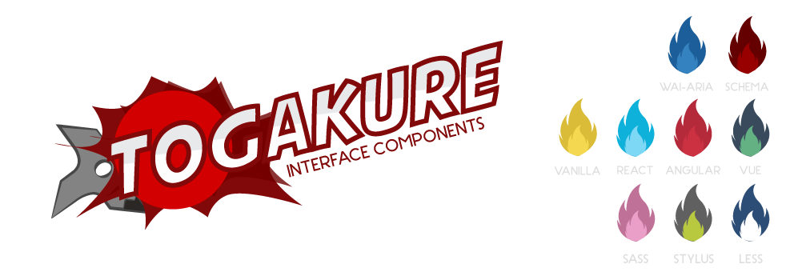

# Togakure Components

[](http://hemersonvianna.mit-license.org/)
[](https://github.com/tgkr/components/issues)




Project that brings together interface components that use the main libraries and frameworks of the front end development community.

## Usage

```
// Vanilla
// localhost:9000
yarn storybook:vanilla

// React
// localhost:9001
yarn storybook:react

// Vue
// localhost:9002
yarn storybook:vue

// Angular
// localhost:9003
yarn storybook:angular
```

## Build

```
// Vanilla
yarn build-storybook:vanilla

// React
yarn build-storybook:react

// Vue
yarn build-storybook:vue

// Angular
yarn build-storybook:angular
```
